# Database

PostgreSQL via Prisma. Schema lives at [`api/prisma/schema.prisma`](../api/prisma/schema.prisma).

## ERD (high-level)

```mermaid
erDiagram
  User ||--o| Wallet : has
  User ||--o{ AuthIdentity : has
  User ||--o{ Passkey : has
  User ||--o{ Device : owns
  User ||--o{ Session : has
  User ||--o{ PushToken : has
  User ||--o{ Transaction : owns
  User ||--o{ AdWatch : performs
  User ||--o{ Deposit : creates
  User ||--o{ Withdrawal : requests
  User ||--o{ Notification : receives
  User ||--o{ UserMission : has
  User ||--o{ UserAchievement : earned
  User ||--o{ Post : authors
  User ||--o{ Comment : writes
  User ||--o{ PostLike : likes
  User ||--o{ Follow : follower
  User ||--o{ FraudSignal : flagged
  User ||--o{ AuditLog : actor
  User ||--o{ Report : reports
  User ||--o{ VoiceRoom : hosts
  User ||--o{ RoomParticipant : joins
  User ||--o{ RoomMessage : posts
  User ||--o{ VoiceGift : sends
  User ||--o{ Referral : parent
  User ||--o{ Referral : child

  Wallet ||--o{ Transaction : ledger

  Ad ||--o{ AdWatch : tracked

  VoiceRoom ||--o{ RoomParticipant : participants
  VoiceRoom ||--o{ RoomMessage : chat
  VoiceRoom ||--o{ VoiceGift : gifts
  VoiceRoom ||--o{ Report : reported

  Mission ||--o{ UserMission : tracked
  Achievement ||--o{ UserAchievement : tracked

  Post ||--o{ Comment : has
  Post ||--o{ PostLike : has
  Comment ||--o{ Comment : replies
```



## Core entities

### User

The hub. Roles: `USER · CREATOR · MODERATOR · ADMIN · SUPER_ADMIN`. Status: `PENDING_VERIFICATION · ACTIVE · SUSPENDED · BANNED · DELETED`. Holds XP, level, streak, optional VIP, referral code, and is the foreign-key parent for all user-owned entities.

### Wallet & Transaction

`Wallet` is one-to-one with User. `Transaction` is the **immutable ledger** — every credit/debit creates a row with `balanceAfter` (computed atomically inside `prisma.$transaction`). Money never moves outside this ledger.

Key indexes: `(userId, createdAt)`, `(walletId, createdAt)`, `type`, `status`, `referenceId`.

### Ad & AdWatch

Ads are configured in DB (with provider, reward amount, duration, country/cap). Every watch creates an `AdWatch` row with start/end times, watch seconds, fraud score, outcome and (if completed) the credited reward amount. Daily caps are enforced in service code.

### Referral

Three-level chain: when user A signs up via B, we create rows:
- `(parent: B, child: A, level: 1, rate: 0.10)`
- `(parent: B's parent, child: A, level: 2, rate: 0.05)`
- `(parent: B's grandparent, child: A, level: 3, rate: 0.02)`

Whenever A earns, `ReferralsService.payCommissions()` walks these rows and credits each parent atomically.

### VoiceRoom

Hosts a room with status / visibility / category. Has many participants (with role + mute), messages, gifts. `passwordHash` is argon2-hashed for password-protected rooms. `rtcRoomId` ties to the WebRTC signaling room.

### Deposit & Withdrawal

Manual workflows with admin moderation:
- **Deposit** — user uploads receipt + TXN ref → admin approves → wallet credited.
- **Withdrawal** — request immediately moves balance to `pending`. Admin completes → withdrawal logs externalRef. Admin rejects → balance refunded atomically.

### Mission, Achievement, UserMission, UserAchievement

Daily/weekly/monthly/one-time missions with goals + rewards (cash + XP). `UserMission` tracks per-user progress. `Achievement` is awarded once per user.

### FraudSignal & AuditLog

`FraudSignal` accumulates security signals with kind + severity + score + JSON details. Resolved manually by admins. `AuditLog` records authentication, money movements, and admin actions for compliance.

### Notification

Polymorphic: kind (REWARD · REFERRAL · VOICE_ROOM · DEPOSIT · WITHDRAWAL · SYSTEM · SECURITY · MARKETING · ACHIEVEMENT) × channel (IN_APP · PUSH · EMAIL · SMS).

### Setting & Announcement

`Setting` is a key/JSON store for runtime configurable knobs (welcome bonus, daily ad cap, referral rates, payment limits). `Announcement` for community broadcasts.

## Indexes

The schema declares indexes on every hot-path lookup:
- `User`: `referredById`, `status`, `role`, `createdAt`
- `Transaction`: `(userId, createdAt)`, `(walletId, createdAt)`, `type`, `status`, `referenceId`
- `AdWatch`: `(userId, startedAt)`, `(adId, startedAt)`, `outcome`
- `VoiceRoom`: `(status, isFeatured)`, `category`, `startedAt`
- `RoomMessage`: `(roomId, createdAt)`
- `Deposit` & `Withdrawal`: `(userId, status)`, `(status, createdAt)`
- `Notification`: `(userId, readAt)`, `createdAt`
- `Referral`: `(parentId, level)`, `childId`
- `FraudSignal`: `(userId, severity)`, `createdAt`
- `Report`, `AuditLog`: per access pattern.

## Migrations & seed

```bash
cd api
npx prisma migrate dev --name init
npx prisma db seed
```

Seed creates: super admin, sample ad, 6 missions, 6 achievements, default platform settings.
